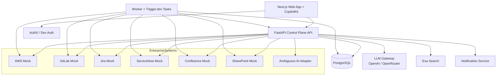
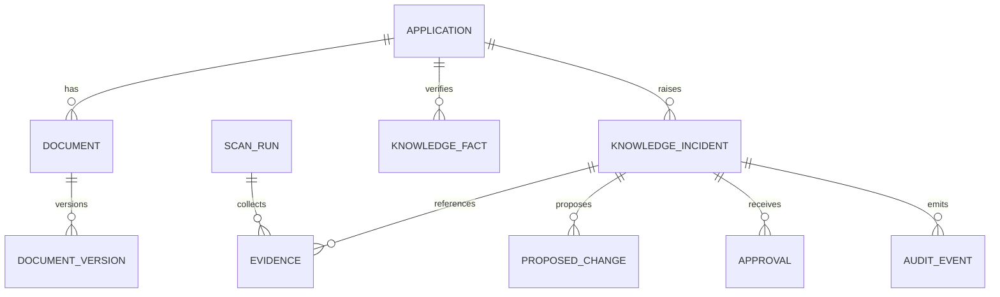
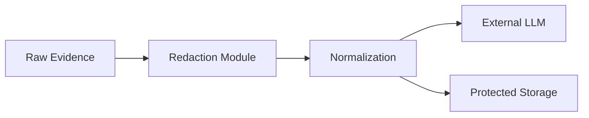
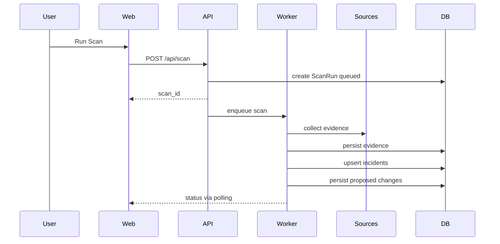

# TrueSource Design Specification

## 1. System Architecture



Architecture principle:

1. API is the control plane for UI interactions, approvals, knowledge retrieval, and scan orchestration.
2. Worker handles asynchronous scan execution, retries, and scheduled work.
3. Mock services remain separate deployable services to preserve realistic enterprise boundaries.
4. PostgreSQL stores canonical incident, evidence, audit, scan, and knowledge state.
5. LLM access is mediated through a provider abstraction with redaction before external calls.

## 2. Proposed Repository Layout

```text
truesource/
├── apps/
│   ├── api/
│   ├── web/
│   └── worker/
├── mocks/
│   ├── aws/
│   ├── gitlab/
│   ├── jira/
│   ├── servicenow/
│   ├── confluence/
│   └── sharepoint/
├── packages/
│   ├── connectors/
│   ├── evidence/
│   ├── security/
│   ├── llm/
│   └── schemas/
├── tests/
│   ├── unit/
│   ├── integration/
│   └── e2e/
├── docs/
├── infrastructure/
├── trigger/
└── .kiro/specs/truesource/
```

Migration approach from current repo:

1. Existing `backend/` evolves into `apps/api/` and related shared packages.
2. Existing `frontend/` evolves into `apps/web/`.
3. Existing `trigger/` remains the Trigger.dev boundary and can also be backed by `apps/worker/` for local async flows.

## 3. Component Architecture

### 3.1 API Components

1. `auth`: dev auth and Auth0 JWT validation.
2. `applications`: application metadata and demo controls.
3. `documents`: document retrieval, versioning, repair, rollback.
4. `evidence`: normalized evidence persistence and retrieval.
5. `incidents`: drift lifecycle, evidence explorer, approvals.
6. `knowledge`: verified facts query and trusted answer service.
7. `scans`: scan creation, status polling, scan history.
8. `audit`: append-only audit events.
9. `notifications`: mock alert publishing.

### 3.2 Worker Components

1. `scan_orchestrator`: coordinates a full scan run.
2. `connector_runner`: executes connector calls concurrently with timeouts.
3. `incident_upserter`: applies idempotent incident creation logic.
4. `repair_pipeline`: generates diffs and document updates.
5. `seed_reset`: restores demo state.

### 3.3 Shared Packages

1. `schemas`: shared DTOs and API schemas for TypeScript and Python parity.
2. `connectors`: base connector interfaces and per-system adapters.
3. `evidence`: normalization, authority scoring, consistency checks, drift detection.
4. `security`: redaction, role guards, audit helpers.
5. `llm`: provider gateway, prompt builders, and fallback logic.

### 3.4 Mock Service Components

Each mock service exposes:

1. REST routes.
2. Seed state store.
3. mutation endpoints for demo transitions or reset.
4. health endpoints.

## 4. Data Model

### 4.1 Core Entities

1. `User`: `id`, `email`, `name`, `role`, `tenant_id`, `auth_provider`, `created_at`.
2. `Application`: `id`, `tenant_id`, `name`, `slug`, `owner`, `status`, `created_at`.
3. `SourceSystem`: `id`, `tenant_id`, `name`, `type`, `base_url`, `authority_weight`, `enabled`.
4. `Document`: `id`, `tenant_id`, `application_id`, `source_system_id`, `external_id`, `title`, `status`, `current_version_id`.
5. `DocumentVersion`: `id`, `document_id`, `version_number`, `content`, `diff_summary`, `created_by`, `created_at`, `rollback_of_version_id`.
6. `ScanRun`: `id`, `tenant_id`, `status`, `trigger_type`, `started_at`, `finished_at`, `requested_by`, `summary`, `error_count`.
7. `Evidence`: `id`, `scan_run_id`, `incident_id`, `application_id`, `source_system_id`, `source`, `source_type`, `entity`, `attribute`, `value_json`, `observed_at`, `collected_at`, `source_reference`, `authority_weight`, `confidence`, `redacted_payload`.
8. `KnowledgeIncident`: `id`, `tenant_id`, `application_id`, `attribute`, `documented_value`, `observed_value`, `confidence`, `confidence_breakdown_json`, `status`, `dedupe_key`, `scan_run_id`, `created_at`, `updated_at`, `resolved_at`.
9. `ProposedChange`: `id`, `incident_id`, `document_id`, `before_content`, `after_content`, `diff_text`, `reason`, `status`.
10. `Approval`: `id`, `incident_id`, `approved_by`, `decision`, `reason`, `created_at`.
11. `KnowledgeFact`: `id`, `tenant_id`, `application_id`, `attribute`, `value`, `status`, `confidence`, `provenance_json`, `verified_at`, `version`.
12. `AuditEvent`: `id`, `tenant_id`, `actor_type`, `actor_id`, `action`, `entity_type`, `entity_id`, `old_value_json`, `new_value_json`, `metadata_json`, `created_at`.
13. `AgentRun`: `id`, `scan_run_id`, `incident_id`, `agent_type`, `provider`, `model`, `status`, `started_at`, `finished_at`, `input_summary`, `output_summary`, `cost_json`.

### 4.2 Relationships



## 5. Evidence Normalization Model

Canonical evidence payload:

```json
{
  "source": "aws",
  "source_type": "operational",
  "entity": "Payments",
  "attribute": "compute",
  "value": "EKS",
  "observed_at": "2026-09-12T10:00:00Z",
  "source_reference": "aws://accounts/demo/services/payments",
  "confidence": 0.99,
  "collected_at": "2026-09-12T10:00:05Z",
  "authority_weight": 1.0,
  "redacted": false
}
```

Required fields:

1. `source`
2. `source_type`
3. `entity`
4. `attribute`
5. `value`
6. `observed_at`
7. `source_reference`
8. `confidence`
9. `collected_at`
10. `authority_weight`

## 6. Source Authority And Confidence Model

### 6.1 Source Authority Baseline

1. AWS operational state: `1.00`
2. ServiceNow closed change: `0.95`
3. Jira completed migration issue: `0.90`
4. GitLab deployment or migration commit: `0.90`
5. Ambiguous AI workspace export: `0.80`
6. Confluence documentation: `0.60`
7. SharePoint documentation: `0.55`
8. Exa external research: `0.40`

### 6.2 Confidence Algorithm

For a candidate fact transition such as `compute: EC2 -> EKS`:

```text
support_score = sum(authority_weight * recency_factor * source_confidence for supporting sources)
contradiction_score = sum(authority_weight * recency_factor * source_confidence for contradicting sources)
coverage_bonus = min(0.1, 0.02 * independent_supporting_sources)
document_staleness_bonus = 0.05 when docs are older than threshold and strong operational support exists
raw_confidence = support_score - 0.35 * contradiction_score + coverage_bonus + document_staleness_bonus
final_confidence = clamp(raw_confidence / normalization_factor, 0, 0.99)
```

Rules:

1. High confidence drift requires at least two independent supporting non-documentation sources and one authoritative operational source.
2. Possible drift is returned when one strong operational source exists but corroboration is incomplete.
3. Missing sources do not reduce confidence as strongly as explicit contradictions.
4. Contradicting documentation increases drift likelihood rather than disproving operational evidence.

### 6.3 Explainability Output

The engine returns:

1. supporting sources
2. contradicting sources
3. missing sources
4. authority breakdown
5. recency breakdown
6. final confidence explanation text

## 7. Drift Detection Engine

Pipeline:

1. Discover applications in scope.
2. Collect evidence concurrently from connectors.
3. Normalize evidence and redact sensitive payloads.
4. Group facts by `(application, attribute)`.
5. Infer observed operational value candidates.
6. Compare against documented values.
7. Calculate confidence and explainability.
8. Upsert incidents using a stable dedupe key.
9. Generate document repair proposals for stale documents.

Incident dedupe key:

```text
tenant_id + application_id + attribute + documented_value + observed_value + unresolved_status
```

## 8. API Contracts

### 8.1 Authentication

Development requests may include headers:

1. `X-Demo-User`
2. `X-Demo-Role`

Production requests use Auth0 bearer tokens.

### 8.2 Core Endpoints

#### `GET /api/health`
Returns service, database, worker, and connector health summary.

#### `GET /api/dashboard`
Returns counts for knowledge health, documents monitored, verified facts, stale documents, incidents by status, and recent scan status.

#### `GET /api/documents`
Returns documents with current version metadata, verification status, and linked incidents.

#### `GET /api/knowledge`
Returns verified knowledge facts grouped by application.

#### `GET /api/drift`
Returns paginated incidents with filters for status, application, and severity.

#### `GET /api/drift/{id}`
Returns incident details, confidence breakdown, proposed changes, approvals, and statuses.

#### `GET /api/drift/{id}/evidence`
Returns normalized evidence and explainability breakdown.

#### `POST /api/scan`
Request:

```json
{
  "scope": ["Payments"],
  "trigger": "manual"
}
```

Response:

```json
{
  "scan_id": "scan_123",
  "status": "queued"
}
```

#### `GET /api/scans/{id}`
Returns scan status, activity feed, connector outcomes, and resulting incident IDs.

#### `POST /api/drift/{id}/approve`
Request:

```json
{
  "reason": "Operational evidence is conclusive"
}
```

Response includes updated document versions and refreshed verified facts.

#### `POST /api/drift/{id}/reject`
Captures reviewer rejection with reason.

#### `POST /api/drift/{id}/rollback`
Restores prior document versions and emits audit events.

#### `POST /api/ask`
Request:

```json
{
  "question": "How is Payments deployed?"
}
```

Response:

```json
{
  "answer": "Payments is currently deployed on EKS.",
  "trust_card": {
    "confidence": 0.97,
    "verified_at": "2026-09-12T10:05:00Z",
    "sources": ["aws", "gitlab", "jira", "servicenow"],
    "documents_updated": ["confluence", "sharepoint"]
  },
  "facts": [
    {
      "attribute": "compute",
      "value": "EKS",
      "confidence": 0.97
    }
  ]
}
```

#### `POST /api/demo/migrate`
Transitions Payments to the migrated state across the relevant mock systems.

#### `POST /api/demo/reset`
Restores all mocks and internal state to initial seed values.

#### `GET /api/audit`
Returns audit history filtered by incident, application, actor, or action.

## 9. Agent Design

Logical agents are implemented as deterministic pipelines plus LLM-assisted summarizers.

### 9.1 Discovery Agent

Inputs: applications, configured connectors, scan scope.

Outputs: applications and attributes requiring evidence collection.

### 9.2 Evidence Agent

Inputs: connector results.

Outputs: normalized and redacted evidence records.

### 9.3 Verification Agent

Inputs: evidence groups by attribute.

Outputs: observed values, contradictions, confidence breakdowns.

### 9.4 Knowledge Agent

Inputs: current documents, document versions, incidents.

Outputs: stale sections, impacted documents, current documented values.

### 9.5 Repair Agent

Inputs: incident, document content, verified facts.

Outputs: proposed diffs, rationale, human-readable summary.

### 9.6 Answer Agent

Inputs: verified knowledge facts and user question.

Outputs: grounded answer, trust card, refusal when knowledge is unverified.

### 9.7 LLM Interaction Rules

1. Use structured JSON evidence inputs.
2. Never let the LLM decide authorization, approval, or source authority weights.
3. Redact secrets before model calls.
4. Prefer JSON outputs that can be validated and repaired deterministically.
5. Support provider routing through OpenAI first and OpenRouter fallback.

## 10. Connector Design

Connector interface concept:

```python
class EnterpriseConnector(Protocol):
    name: str
    source_type: str
    authority_weight: float

    async def health_check(self) -> ConnectorHealth: ...
    async def collect(self, application: str) -> list[NormalizedEvidence]: ...
    async def get_entity(self, external_id: str) -> dict: ...
    async def get_changes(self, application: str) -> list[dict]: ...
```

Concrete adapters:

1. `AWSMockConnector`
2. `GitLabMockConnector`
3. `JiraMockConnector`
4. `ServiceNowMockConnector`
5. `ConfluenceMockConnector`
6. `SharePointMockConnector`
7. `AmbiguousMockConnector`
8. placeholder real connectors for future production use

Rules:

1. Adapters map external payloads into normalized evidence.
2. Application code never depends on raw source payload formats.
3. Connectors annotate evidence with source reference URIs.

## 11. Security Model

### 11.1 Auth

1. Dev mode injects a local user and role from configuration or headers.
2. Production validates Auth0 JWTs and maps claims to roles and tenants.

### 11.2 Authorization

1. View endpoints require authenticated users.
2. Approval and rollback require reviewer or administrator role.
3. Demo reset requires administrator role in non-demo environments.

### 11.3 Redaction And Privacy

Sensitive patterns to redact before LLM egress:

1. AWS access keys
2. JWTs
3. API keys
4. passwords
5. private keys
6. credential-bearing connection strings
7. optionally emails and other PII

Redaction flow:



### 11.4 Safe Update Policy

1. All proposed changes are reviewable before execution.
2. Updates occur only against supported document mocks in MVP.
3. Every change creates document versions and audit events.
4. Rollback is always available for approved changes.

## 12. Event And Workflow Model

### 12.1 Scan Workflow



### 12.2 Approval Workflow

1. Reviewer opens incident.
2. Reviewer inspects evidence and diff.
3. Reviewer approves.
4. API records approval and audit event.
5. Document update service updates Confluence and SharePoint mocks.
6. Document versions and verified facts are refreshed.
7. Notifications are emitted.

### 12.3 Trigger.dev Workflows

1. scheduled scan every 15 minutes
2. retry failed connector collections
3. async document synchronization
4. optional notification fan-out

## 13. UI And UX Design

Primary surfaces:

1. Overview dashboard
2. Incident detail view
3. Evidence explorer
4. Proposed diff viewer
5. Audit trail panel
6. Ask the Company panel with trust card
7. Agent activity rail
8. Embedded notification panel simulation

Design principles:

1. polished enterprise AI aesthetic, not CRUD admin screens
2. strong status semantics for verified, stale, pending, failed
3. evidence-first review experience
4. one-click demo controls for reset, migrate, scan, approve
5. responsive layout for judges and laptops
6. CopilotKit-powered conversational and structured agent UI

Key incident screen requirements:

1. documented value
2. observed value
3. confidence and explanation
4. supporting and disagreeing sources
5. affected documents
6. proposed diffs
7. approval actions
8. audit history

## 14. Testing Strategy

### 14.1 Unit Tests

1. source authority calculation
2. confidence scoring
3. drift detection
4. redaction
5. diff generation
6. answer agent refusal logic

### 14.2 Integration Tests

1. each mock connector HTTP integration
2. document update and versioning
3. auth role enforcement
4. scan orchestration persistence

### 14.3 End-To-End Tests

Scenario:

1. reset demo
2. verify Payments starts on EC2
3. simulate migration
4. run scan
5. verify incident appears with evidence
6. approve change
7. verify document updates and version increments
8. ask question
9. verify EKS answer with trust card
10. reset and verify EC2 restored

## 15. Deployment Architecture

### 15.1 Local Docker Compose

Services:

1. `web`
2. `api`
3. `worker`
4. `postgres`
5. `mock-aws`
6. `mock-gitlab`
7. `mock-jira`
8. `mock-servicenow`
9. `mock-confluence`
10. `mock-sharepoint`

### 15.2 Cloud Run

Deployables:

1. `truesource-api`
2. `truesource-web`
3. optional `truesource-worker` or Trigger.dev-hosted workflow backend
4. managed PostgreSQL via Cloud SQL

Environment differences:

1. no Docker service discovery; use public or internal service URLs
2. secrets from Secret Manager
3. Auth0 enabled
4. Cloud SQL connection configuration
5. CORS tightened to frontend domain

## 16. Sponsor Technology Mapping

1. OpenAI: explanation, repair wording, verified answer generation
2. CopilotKit: web agent experience, structured actions, embedded assistant panel
3. OpenRouter: provider fallback for reasoning tasks
4. Exa: supplemental public research for vendor or tech verification
5. Auth0: authn and role-aware authz in production
6. Ambiguous AI: adapter layer for enterprise workspace access
7. Trigger.dev: scheduled scans and async workflows
8. Mozilla: redaction, provenance, privacy-first evidence handling
9. Google Cloud Run: containerized deployment target
