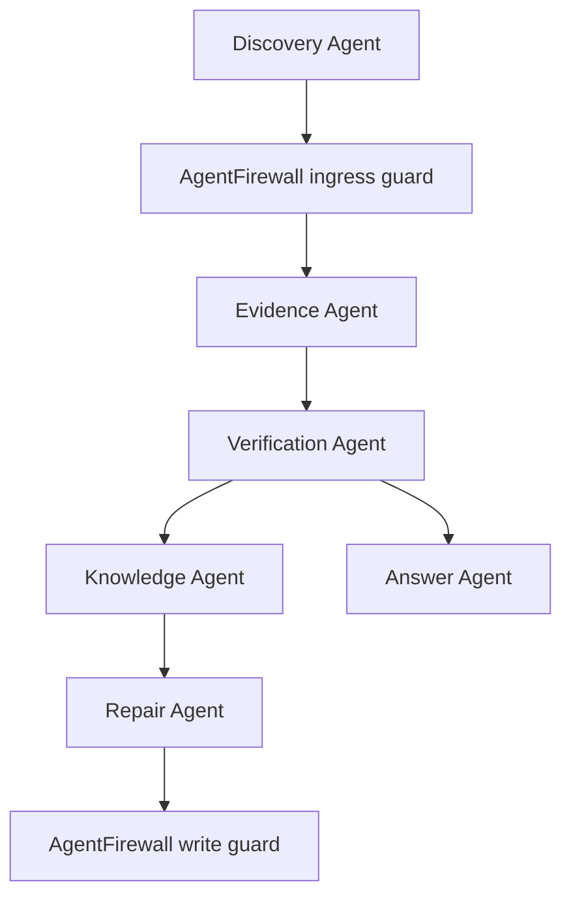

# Agent Architecture

TrueSource uses deterministic software for evidence handling and governance, with LLMs reserved for explanation and synthesis.

## Logical agents

1. Discovery Agent: selects applications and attributes to inspect during a scan.
2. AgentFirewall: investigates untrusted evidence, quarantines agent-targeted instructions, and controls document-write capabilities.
3. Evidence Agent: calls connectors, normalizes evidence, and applies redaction.
4. Verification Agent: calculates authority-weighted confidence and determines drift.
5. Knowledge Agent: identifies affected documents and the currently documented values.
6. Repair Agent: proposes document diffs for stale knowledge.
7. Answer Agent: answers questions from verified facts only.

## Interaction model

## Safety rules

1. No document updates without reviewer approval.
2. No source authority decisions delegated to the LLM.
3. No secrets or credentials sent to an external model.
4. No answers generated from unverified knowledge.
