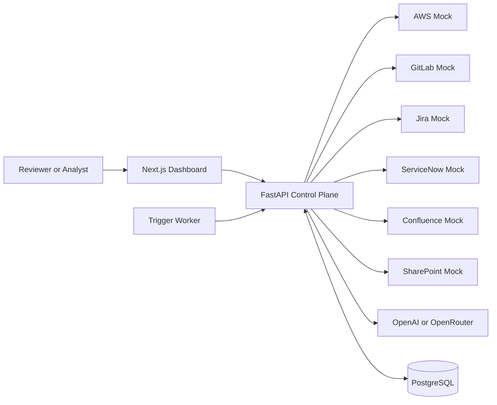
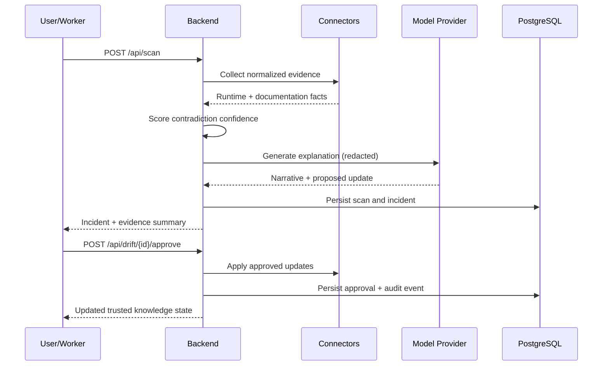

# Architecture

TrueSource is built as a control plane between enterprise system facts and AI answers. The design intentionally separates deterministic evidence collection from model-generated narrative so that source-of-truth decisions remain auditable.

## System topology

## Component responsibilities

1. Frontend (Next.js)
	- Provides dashboard operations: simulate migration, run scan, approve or reject incidents, ask grounded questions, and inspect runtime/auth status.
	- Uses token-aware API requests when Auth0 is enabled, with safe development fallback when Auth0 is disabled.

2. Backend (FastAPI)
	- Orchestrates scans across connectors and calculates deterministic contradiction confidence.
	- Manages incident lifecycle, approval gates, audit events, and runtime metadata.
	- Applies redaction and provider routing before model egress.

3. Connector services (mock microservices)
	- Expose source-specific APIs for AWS, GitLab, Jira, ServiceNow, Confluence, and SharePoint.
	- Enable reproducible drift scenarios without dependency on live enterprise systems.

4. Persistence (PostgreSQL)
	- Stores runtime control-plane state including scans, incidents, evidence snapshots, and audit records.
	- Reloads state during backend startup so demo and workflow continuity survive container restarts.

5. Worker (Trigger runtime)
	- Triggers scan jobs through backend APIs on schedule or manual invocation.

6. Model gateway
	- Supports OpenAI and OpenRouter under a common provider abstraction.
	- Can fall back to deterministic explanation mode when provider credentials are missing.

## Scan and remediation flow

## Trust and security boundaries

1. Source authority is deterministic.
	- Connectors and scoring decide whether drift exists.
	- LLM output does not create truth by itself.

2. Redaction before model calls.
	- Sensitive patterns are scrubbed prior to provider requests.

3. Role-gated operations.
	- Approval and rejection actions require reviewer authorization.
	- Development mode supports demo headers; production mode validates Auth0 JWTs.

4. Full auditability.
	- Every scan and approval decision is written to audit/event history.

## Authentication modes

1. Development mode
	- Enabled when Auth0 environment is not configured.
	- Uses local actor headers and keeps demo workflows unblocked.

2. Production mode
	- Enabled when Auth0 issuer, audience, and signing configuration are present.
	- Backend validates bearer tokens and exposes caller identity via auth endpoints.

## Provider routing model

1. Provider resolution order
	- Request override from the dashboard.
	- Backend default provider setting.
	- Deterministic fallback if external providers are unavailable.

2. Runtime introspection
	- Runtime endpoint reports effective provider availability so operators can verify configuration quickly.

## Deployment model

1. Local stack
	- Docker Compose brings up frontend, backend, postgres, six connector mocks, and worker.

2. Cloud path
	- Cloud Run manifests exist for API and web services.
	- Trigger deployment can remain external or run as a separate worker target.

## Design rationale

RAG quality depends on knowledge quality. TrueSource enforces provenance, freshness, confidence, and reviewer approval as first-class metadata so downstream assistants consume trusted context instead of stale documentation.
