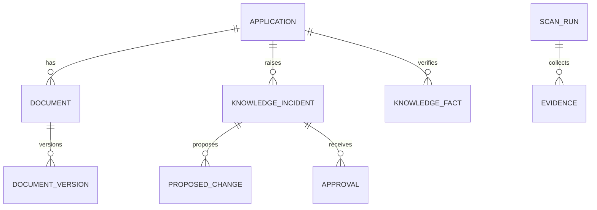

# Data Model

The target platform data model centers on scans, incidents, evidence, documents, approvals, and verified facts.

## Core entities

1. Application
2. User
3. SourceSystem
4. ScanRun
5. Evidence
6. KnowledgeIncident
7. ProposedChange
8. Approval
9. Document
10. DocumentVersion
11. KnowledgeFact
12. AuditEvent
13. AgentRun

## Relationships

## MVP note

The current implementation keeps scan, incident, audit, and verified-knowledge state in memory while PostgreSQL is provisioned in Docker Compose for the next persistence phase.
